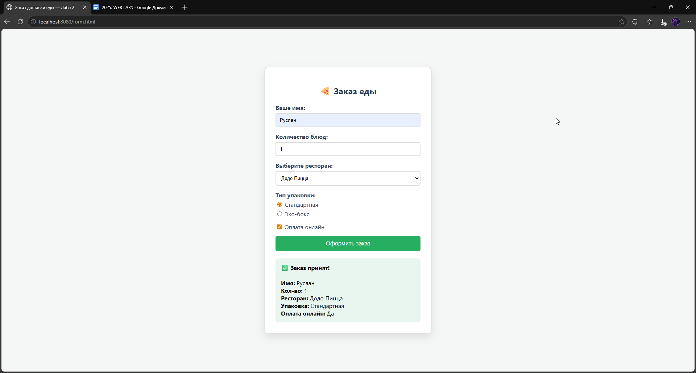
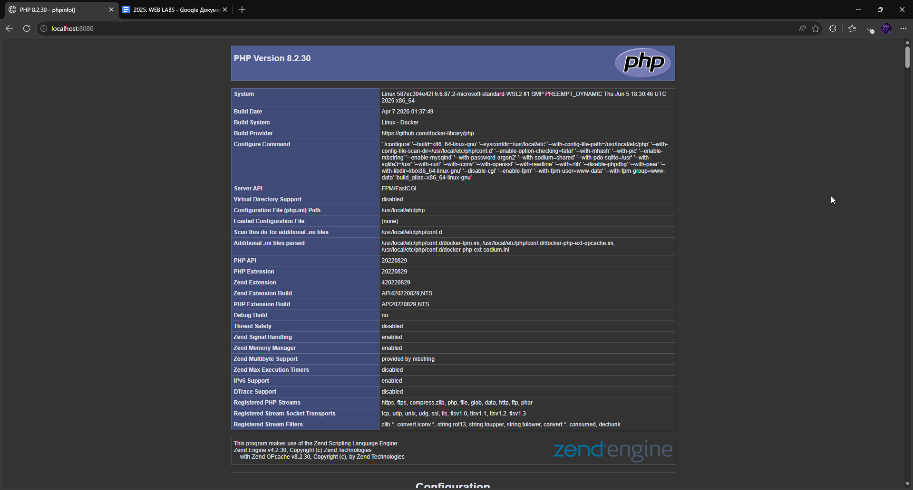

# Лабораторная работа №2: Настройка Nginx + PHP-FPM. Основы HTML-форм и обработка на JavaScript.

## 📌 Описание задания
- Научиться конфигурировать веб-сервер Nginx для работы с PHP через PHP-FPM.
- Освоить базовые принципы PHP (на примере phpinfo()).
- Повторить основы HTML: работа с формами, различными типами полей ввода.
- Освоить базовую обработку форм с помощью JavaScript без перезагрузки страницы.

---

## ⚙️ Как запустить проект

1. Клонировать репозиторий:
   ```bash
   git clone https://github.com/Jasternaut/web_lab_2
   cd web_lab_2
2. Запустить контейнеры:
   ```bash
   docker-compose up -d --build
   ```
Открыть в браузере:
```http://localhost:8080```
## 📂 Содержимое проекта

```docker-compose.yml``` — описание сервиса Nginx

```www/index.php``` — главная страница с информацией о php

```www/form.html``` – страница с формой

```screenshots/``` — все скриншоты

## 📸 Скриншоты работы

</img>
</img>

✅ Результат
Сервер в Docker успешно запущен, Nginx отдаёт мою HTML-страницу.
